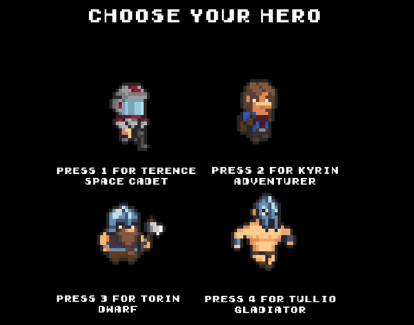

# Rage Arena
Elaborato in C++ per l'esame di Programmazione (Prof. Bertini)

Gioco sviluppato da **Mazzadini Studios**
Membri fondatori: 
* **Cristian Mazzarone**  <cristian.mazzarone@stud.unifi.it>

* **Gianluca Rosadini** <gianluca.rosadini@stud.unifi.it>

# Descrizione
Gioco di azione Platform 2D con attacchi a distanza, in mischia, e gestione delle collisioni, ispirato ai videogames delle sale giochi anni '90.

## Obiettivo del gioco

Dopo una schermata di presentazione, compare una schermata di scelta dell'eroe, in cui si deve scegliere uno tra 4 personaggi con differenti caratterstiche di attacco (distanza/mischia). 
Lo scopo del gioco è quello di uccidere quanti più nemici possibile, organizzati in due ondate su ogni mappa. 
Al termine della seconda ondata di nemici nella prima mappa, si accede alla seconda tramite una porta che si apre in automatico.
Nella seconda mappa dobbiamo affrontare il boss insieme a nemici generici, che possiede due tipi di attacchi: in mischia se gli siamo vicini, o un raggio laser a distanza se gli siamo lontani.
Se il boss viene sconfitto il gioco termina con una schermata di EndGame classica, dove è possibile dare un comando di Restart o di Quit Game. 

# Struttura del gioco
Il gioco è sviluppato in c++11 e basato sulle [librerie SFML](www.sfml-dev.org)

## Classi Principali:

* **Elements**: classe che gestisce tutto ciò che viene stampato sullo schermo e sulla mappa

* **Entity**: classe che eredita Elements e gestisce tutto ciò con cui si può interagire: giocatori, tiles rompibili, proiettili etc.

* **UserInterface**: eredita Elements e gestisce tutto ciò che dà informazioni all'utente (Lifebar)

* **Tile**: Permette di istanziare le caselle che vanno a comporre la mappa 

* **Map**: Si occupa della creazione della mappa e della gestione degli eventi che la modificano, come l'apertura di porte, attraverso un Observer Pattern

Tutti gli oggetti (eroi, nemici, proiettili...) vengono creati attraverso delle Factory dato che hanno bisogno di essere preparati prima di essere utilizzati. 
I nemici usano uno Strategy Pattern **"MoveStrategy"** per cambiare il comportamento a runtime a seconda della distanza tra loro e l'eroe, il quale può essere seguito (**Follow**), oppure no (**Patrol**).

# VideoClips

## BENVENUTO IN RAGE ARENA!

Questi quattro potenti eroi sono al tuo servizio, **scegli il tuo preferito!**

Sei un tipo meticoloso? Scegli Terence, lo Space Cadet, e fai fuori i nemici da lontano.

Sei un tipo impulsivo? Con gli altri tre personaggi puoi confrontarti faccia a faccia con i tuoi nemici!

Distruggi tutti i barili! All'interno troverai delle pozioni per curare le tue ferite!

Questo è il boss finale, un antico Ciclope infuriato, sarai capace di sconfiggerlo?

Solo se batterai il Ciclope potrai tornare a casa sano e salvo! Fai del tuo meglio!

# Credits
Tutte le sprite sono state realizzate da Elthen. Ecco il link al suo patreon: [patreon/Elthen](https://www.patreon.com/elthen)

